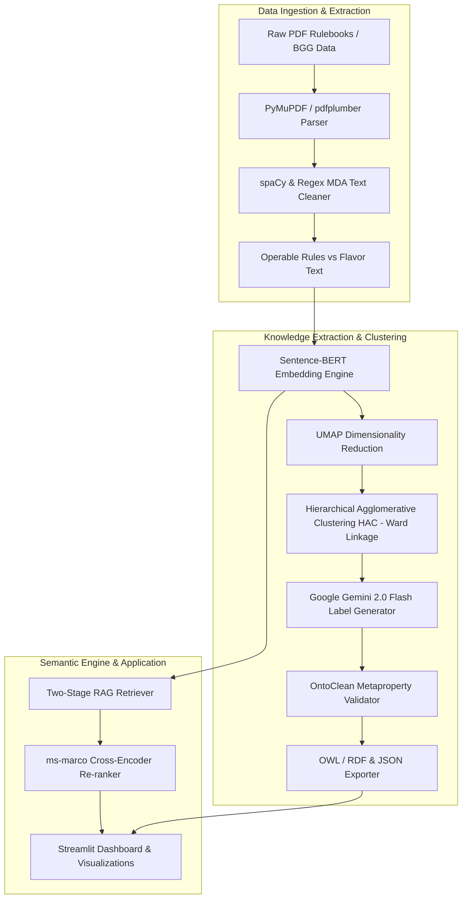

<div align="center">
  <h1>🧠 AI Driven Ontology Extraction and Semantic Tooling for Board Game Design</h1>
  <p><strong>Ontology-Guided Hybrid Retrieval & Semantic Design Tool</strong></p>
  
  [](https://www.python.org/downloads/)
  [](LICENSE)
  [](https://ontology-extraction-and-semantic-tooling-for-board-game-design.streamlit.app/)
  [](#-theoretical-frameworks)
  [](#-theoretical-frameworks)
</div>

---

## 📌 Overview

**AI Driven Ontology Extraction and Semantic Tooling for Board Game Design** is an end-to-end research platform and AI framework designed to formalize, structure, and explore the landscape of board game mechanics. 

By bridging raw, unstructured rulebook text with formal game studies, the system extracts operable game mechanics, clusters them into a mathematically validated hierarchical taxonomy (ontology), labels clusters using **Google Gemini 2.0 Flash**, validates taxonomy integrity via **OntoClean**, and exposes the extracted domain knowledge through a **Two-Stage Hybrid RAG Semantic Search** engine and an interactive **Streamlit Dashboard**.

---

## 📐 System Architecture & Pipeline



---

## ✨ Key Features

- **📄 Layout-Aware Rulebook Parsing**: Spatial coordinate extraction and multi-column rulebook parsing via `PyMuPDF` with fallback to `pdfplumber`.
- **🧹 MDA-Aligned Sentence Classification**: Uses `spaCy` dependency parsing to isolate actionable mechanics (Algorithms/Rules) from background lore (Flavor).
- **🌳 Automated Hierarchical Ontology**: Semantic vector representation via Sentence-BERT (`all-MiniLM-L6-v2`) and Ward's linkage `HAC` for automatic taxonomy tree creation.
- **🤖 LLM Cluster Labeling**: Prompt-engineered Google Gemini 2.0 Flash (`google-genai` SDK) to assign formal, academic, MDA-compliant labels to generated mechanical clusters.
- **🛡️ Formal OntoClean Validation**: Checks hierarchical subsumption constraints (Identity, Rigidity, Unity, Dependence) based on Guarino & Welty metaproperties.
- **🔍 Two-Stage Hybrid RAG**: High-recall Cosine Similarity initial retrieval followed by high-precision Cross-Encoder re-ranking (`ms-marco-MiniLM-L-6-v2`).
- **📊 Interactive Streamlit Dashboard**: 2D UMAP scatter projections, interactive dendrograms, IR performance evaluation metrics (Precision@K, Recall@K, MRR, MAP), and RDF/OWL export options.

---

## 🛠️ Technical Architecture & Stack

| Layer | Technology | Purpose |
| :--- | :--- | :--- |
| **Embeddings** | Sentence-BERT (`all-MiniLM-L6-v2`) | 384-dimensional semantic dense vector representation |
| **Reduction** | UMAP | Manifold projection for 2D visualization & low-dim clustering |
| **Clustering** | HAC (Ward's Linkage + Euclidean distance) | Hierarchical agglomerative tree structuring |
| **LLM Labeling** | Google Gemini 2.0 Flash (`google-genai` SDK) | MDA-guided cluster labeling & mechanics summarization |
| **Validation** | OntoClean Metaproperties Framework | Subsumption hierarchy logical integrity verification |
| **RAG Search** | Two-Stage (SBERT Cosine + Cross-Encoder) | High-precision natural language semantic query retrieval |
| **PDF Parsing** | PyMuPDF (`fitz`), `pdfplumber`, `pdf2image` | Layout parsing & multi-column text extraction |
| **NLP** | `spaCy` (`en_core_web_sm`), `KeyBERT` | Sentence tokenization, POS tagging, & keyword extraction |
| **Export** | RDFLib | Formal OWL/RDF taxonomy generation |
| **Interface** | Streamlit | Responsive dark-themed design dashboard |

---

## 📁 Repository Structure

```text
boardgame-mechanics-ai/
├── app.py                     # Main Streamlit dashboard application
├── config.py                  # Central configuration, paths, & model hyperparameters
├── run_calculations.py        # Pre-calculation pipeline for embeddings, UMAP, & HAC
├── pyproject.toml             # Project build configuration & metadata
├── requirements.txt           # Python dependencies
├── LICENSE                    # MIT License
├── README.md                  # Project documentation
│
├── knowledge_extraction/      # Core ontology building & text processing modules
│   ├── pdf_parser.py          # Spatial PDF rulebook parser
│   ├── text_cleaner.py        # MDA rule classifier & text cleaner
│   ├── bgg_scraper.py         # BoardGameGeek API & web scraper
│   ├── clustering.py          # HAC clustering & UMAP pipeline
│   ├── label_generator.py     # Gemini Flash LLM cluster labeler
│   ├── ontoclean_validator.py # OntoClean metaproperty validation engine
│   └── ontology_exporter.py   # RDFLib OWL/RDF & JSON ontology exporter
│
├── semantic_engine/           # RAG retrieval & evaluation modules
│   ├── embeddings.py          # Sentence-BERT embedding wrapper & UMAP reducer
│   ├── rag_retriever.py       # Two-stage RAG retriever (Cosine + Cross-Encoder)
│   └── evaluator.py           # IR Evaluation metrics (Precision@K, MAP, MRR)
│
├── shared/                    # Shared helper utilities & constants
└── data/                      # Dataset, raw PDFs, and generated output directory
    ├── raw_pdfs/              # Input PDF rulebooks
    ├── parsed_markdown/       # Extracted markdown rules
    ├── cleaned_rules/         # Processed & classified mechanics
    └── ontology_output/       # Generated JSON and RDF/OWL ontology files
```

---

## 🚀 Quick Start Guide

### 1. Prerequisites & Installation

Ensure you have Python 3.10+ installed.

```bash
# 1. Clone the repository
git clone https://github.com/akashhh-codes/boardgame-mechanics-ai.git
cd boardgame-mechanics-ai

# 2. Create and activate a virtual environment
python -m venv venv
# On Windows:
venv\Scripts\activate
# On Linux/macOS:
source venv/bin/activate

# 3. Install Python dependencies
pip install -r requirements.txt

# 4. Download required spaCy language model
python -m spacy download en_core_web_sm
```

### 2. Environment Configuration

Create a `.env` file in the project root directory to store your Google Gemini API key:

```env
GEMINI_API_KEY=your_gemini_api_key_here
```

### 3. Running the Pipeline & Dashboard

#### Pre-calculate Embeddings & Ontology:
```bash
python run_calculations.py
```

#### Launch the Streamlit Dashboard:
```bash
streamlit run app.py
```
Open your browser at `http://localhost:8501`.

---

## 📚 Theoretical Frameworks

1. **MDA Framework (Mechanics, Dynamics, Aesthetics)**: Rules are categorized at the **Mechanics** level (operable algorithms), distinguishing actionable player constraints from narrative **Flavor**.
2. **OntoClean Validation**: Applies formal ontology metaproperties (**Identity `+I/-I`**, **Rigidity `+R/-R`**, **Unity `+U/-U`**, **Dependence `+D/-D`**) to prevent anti-rigid classes from subsuming rigid classes.
3. **Two-Stage RAG Retrieval**: First stage uses fast bi-encoder vector similarity (`all-MiniLM-L6-v2`), second stage re-ranks top candidates using a cross-encoder model to capture fine-grained semantic nuances.

---

## 📜 License

Distributed under the **MIT License**. See [`LICENSE`](LICENSE) for more details.
